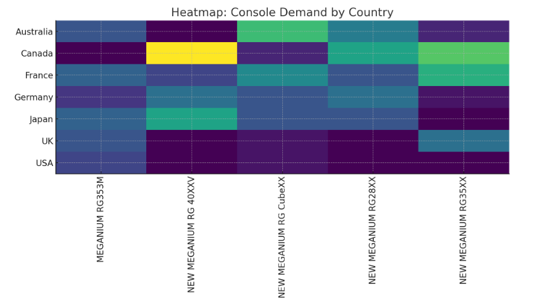
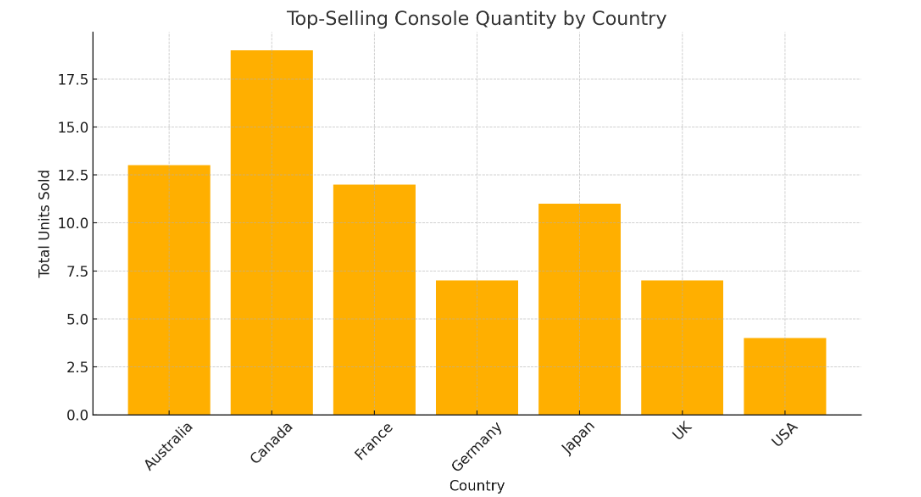

# Análise de Demanda de Consoles - Meganium

Este projeto tem como objetivo transformar dados de vendas em **insights estratégicos** para o fabricante de consoles Meganium, visando otimizar a **alocação logística global** com base nas preferências regionais.

---

## 🔍 1. Análise Exploratória dos Dados (EDA)

**Colunas identificadas:**
- SKU, product_sold, date, quantity, unit_price, total_price, currency, site, discount_coupon, discount_value, buyer_birth_date, buyer_name, delivery_country, invoice_id.

**Consistência dos dados:**
- Nenhum valor faltante encontrado.
- Base bem estruturada, ideal para análises.

---

## 🌎 2. Produtos Mais Populares por País

| País       | Console Mais Vendido         | Quantidade Total |
|------------|------------------------------|------------------|
| Austrália  | NEW MEGANIUM RG CubeXX       | 13               |
| Canadá     | NEW MEGANIUM RG 40XXV        | 19               |
| França     | NEW MEGANIUM RG CubeXX       | 12               |
| Alemanha   | NEW MEGANIUM RG 40XXV        | 7                |
| Japão      | NEW MEGANIUM RG 40XXV        | 11               |
| Reino Unido| NEW MEGANIUM RG35XX          | 7                |
| EUA        | NEW MEGANIUM RG35M           | 4                |

### Principais insights:
- **RG 40XXV** domina no **Canadá, Japão e Alemanha**.
- **RG CubeXX** lidera na **Austrália e França**.
- **RG35XX** e **RG35M** preferidos em **UK** e **EUA**, respectivamente.

---

## 📊 3. Visualizações

### 🔥 Heatmap: Demanda por Modelo em Cada País


### 📈 Gráfico de Barras: Quantidade Vendida por País


---

## 🚚 4. Otimização Logística Recomendável

**Ações sugeridas com base na análise:**

1. **Envios baseados em demanda prevista**
   - Utilize o CSV `Meganium_Regional_Demand.csv` para priorizar o envio dos consoles mais vendidos por região.

2. **Hubs regionais**
   - Estabelecer centros próximos a mercados-chave (ex.: **Canadá e Austrália**) para distribuição eficiente de modelos RG 40XXV e RG CubeXX.

3. **Previsão dinâmica**
   - Atualizar a análise mensalmente para captar **sazonalidades** com base na coluna `date`.

4. **Integração com distribuidores**
   - Compartilhar relatórios e dashboards para sincronizar pedidos com as **projeções de demanda**.

---

## 📁 5. Artefatos Gerados

- **Visualizações:**
  - Tabela EDA (colunas + valores nulos)
  - Tabela de demanda agregada
  - Heatmap de demanda regional
  - Gráfico de barras por país

---

Com estes dados, a Meganium pode:
- Reduzir redistribuições,
- Evitar excesso de estoque,
- Melhorar prazos de entrega,
- Aumentar a satisfação dos parceiros locais.

---

## 🧠 Reprodutibilidade da Análise (Python Script)

```python
import pandas as pd
import matplotlib.pyplot as plt

# Load the dataset
df = pd.read_csv('Meganium_Sales_Data.csv')

# EDA
eda_summary = pd.DataFrame({
    'column': df.columns,
    'missing_values': df.isnull().sum().values
})

# Agrupamento
aggregated = (
    df
    .groupby(['delivery_country', 'product_sold'])
    .agg(total_quantity=('quantity', 'sum'),
         total_revenue=('total_price', 'sum'))
    .reset_index()
)
aggregated.to_csv('Meganium_Regional_Demand.csv', index=False)

# Heatmap
pivot = aggregated.pivot(index='delivery_country', columns='product_sold', values='total_quantity').fillna(0)
plt.figure()
plt.imshow(pivot, aspect='auto')
plt.xticks(range(len(pivot.columns)), pivot.columns, rotation=90)
plt.yticks(range(len(pivot.index)), pivot.index)
plt.title('Heatmap: Console Demand by Country')
plt.tight_layout()
plt.savefig('heatmap_meganium.png')

# Top produtos
top_products = (
    aggregated
    .sort_values(['delivery_country', 'total_quantity'], ascending=[True, False])
    .groupby('delivery_country')
    .first()
    .reset_index()
)

# Gráfico de barras
plt.figure()
plt.bar(top_products['delivery_country'], top_products['total_quantity'], color='orange')
plt.xticks(rotation=45)
plt.title('Top-Selling Console Quantity by Country')
plt.xlabel('Country')
plt.ylabel('Total Units Sold')
plt.tight_layout()
plt.savefig('top_selling_consoles.png')
```

---

**Meganium Global Console Strategy — com base em dados.**
